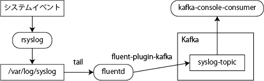

============================================
fluent-plugin-kafka: fluentd と Kafka の連携
============================================

（最終更新：2016 年 1 月 1 日）

`fluentd <http://kafka.apache.org/documentation.html#quickstart>`_ 自体の詳しい説明は他に譲るとして、本文書では fluentd と Kafka を組み合わせる方法を紹介する。本文書を読むと、fluentd で syslog を読み取り、Kafka に流す設定がわかる。Kafka の起動手順は `Apache Kafka Quick Start <http://kafka.apache.org/documentation.html#quickstart>`_ を参照のこと。

本文書で作成するシステムは下図のようになる。

fluentd で syslog を読み取る
============================

fluentd と Kafka を組み合わせる練習として fluentd で syslog を読み取ってみよう。syslog は適度にいろいろなログが出力されるので見ていて楽しい。はじめはデバッグのために、読み取ったログデータを標準出力に垂れ流すことにする。

まずは syslog の出力フォーマットを確認する。Ubuntu 15.04 では標準で rsyslog が稼働しているので、その設定を確認する。

/etc/rsyslog.conf::

   $ActionFileDefaultTemplate RSYSLOG_TraditionalFileFormat

標準ではこのような設定になっているはずだ。 `rsyslog のドキュメント <http://www.rsyslog.com/doc/master/configuration/templates.html#reserved-template-names>`_ によれば、 ``RSYSLOG_TraditionalFileFormat`` は事前定義されたテンプレートで、次のような内容になっている::

   "%TIMESTAMP% %HOSTNAME% %syslogtag%%msg:::sp-if-no-1st-sp%%msg:::drop-last-lf%\n"

実際に /var/log/syslog を確認するとそうなっていることがわかる。タイムスタンプ、ホスト名、タグ、メッセージがスペース区切りになっている。設定の中の ``sp-if-no-1st-sp`` は、メッセージの先頭にスペース文字が入っていた場合に、スペース文字が重複しないようにするための設定だ。

このログを読み取るための fluentd の設定を次に示す::

   <source>
     @type tail
     format /^(?<time>\w+ \d+ [\d:]+) (?<hostname>[^ ]+) (?<syslogtag>[^:]+): (?<msg>.*)$/
     path /var/log/syslog
     tag syslog
   </source>

   <match syslog>
     @type stdout
   </match>

TreasureData によるビルド済みパッケージ `td-agent <http://docs.fluentd.org/articles/install-by-rpm>`_ を利用している場合、設定ファイルは /etc/td-agent/td-agent.conf にあるはずだ。上記の設定を、そのファイルの一番後ろに追記すればよい。

fluentd が /var/log/syslog を読み取れるようにパーミッションを調整するのが大切だ。td-agent はデフォルトで td-agent ユーザで動くため /var/log/syslog を読めない。そこで td-agent ユーザから読めるようにパーミッションを緩めるか、td-agent を /var/log/syslog が読めるユーザ（例えば root）で動くようにする必要がある。

`Fluentdでsyslogを取り込むための権限設定 <http://y-ken.hatenablog.com/entry/fluentd-syslog-permission>`_ が参考になった。rsyslog が /var/log/syslog をローテートする際の新規作成パーミッションを調整することと、既存の /var/log/syslog のパーミッションを緩めることがミソだ。

パーミッションの設定ができたら、次のコマンドで rsyslog と td-agent の設定を有効化する::

   $ sudo service rsyslog restart
   $ sudo service td-agent reload

設定が完了したらログが回収されていることを確認する。回収したログは td-agent の標準出力に出すことにしたので /var/log/td-agent/td-agent.log を見れば良い::

   $ sudo tail -f /var/log/td-agent/td-agent.log

もうひとつ端末を開き、syslog に実験用のログを出してみる::

   $ logger hogehoge

tail していた方に hogehoge ログが出力されれば成功だ。

fluentd から Kafka に流す
=========================

fluentd が正常にログを収集できたら、いよいよ Kafka につないでみる。fluentd と Kafka の接続には `fluent-plugin-kafka <https://github.com/htgc/fluent-plugin-kafka>`_ を使うのが簡単だ。gem コマンドでプラグインをインストールする::

   $ sudo /opt/td-agent/embedded/bin/gem install fluent-plugin-kafka

インストールできたら fluentd の設定ファイルの match を書き換える::

   <match syslog>
     @type kafka
     brokers localhost:9092
     zookeeper localhost:2181
     default_topic syslog-topic
   </match>

Kafka クラスタを起動させ（便利な起動スクリプトは後述）、syslog 用トピックを作り、ログ取得用のコンシューマを立ち上げておく::

   $ cd kafka_2.11-0.9.0.0
   $ bin/kafka-topics.sh --zookeeper localhost:2181
   --create --replication-factor 1 --partitions 1 --topic syslog-topic
   $ bin/kafka-console-consumer.sh --zookeeper localhost:2181
   --topic syslog-topic --from-beginning

この状態で fluentd の設定をリロードすればログが Kafka へと流れ始める::

   $ sudo service td-agent reload
   $ logger foobar

